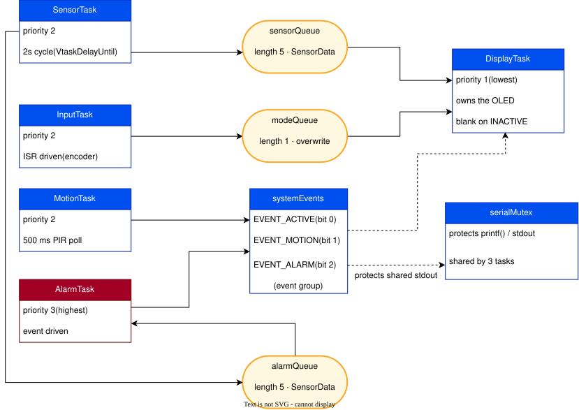
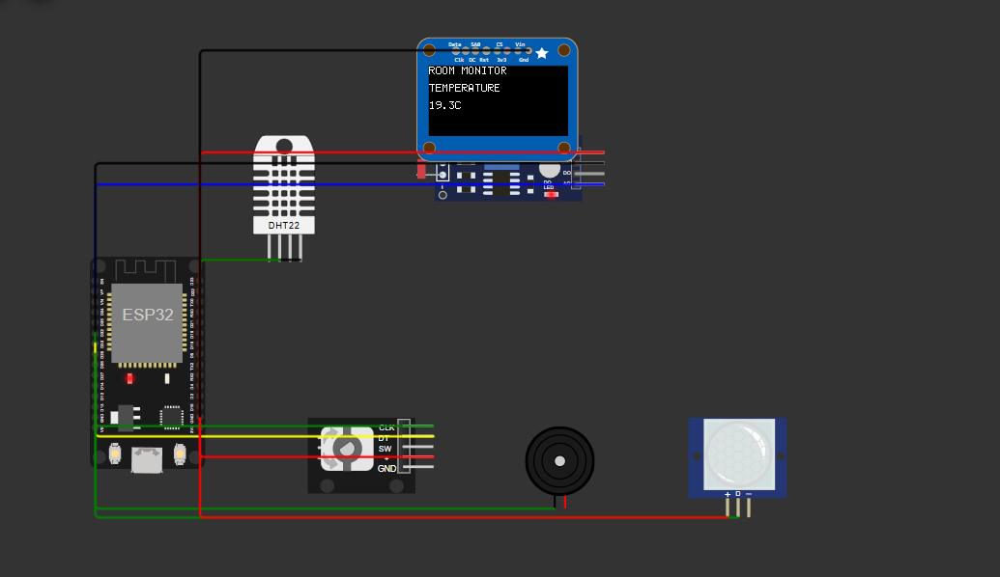
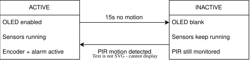
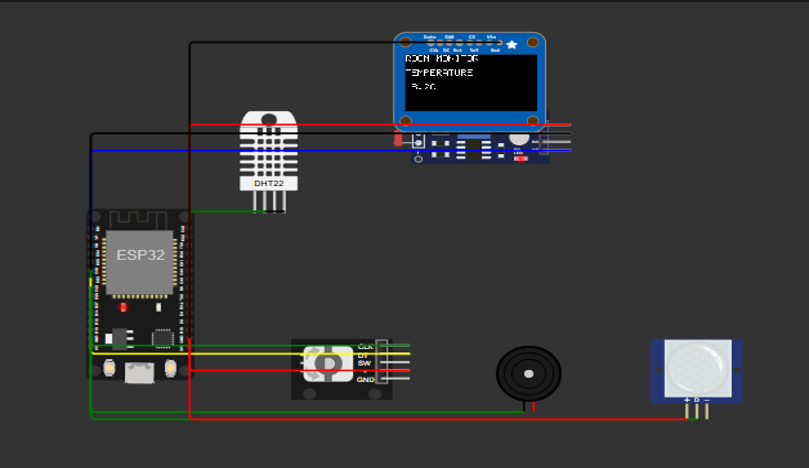
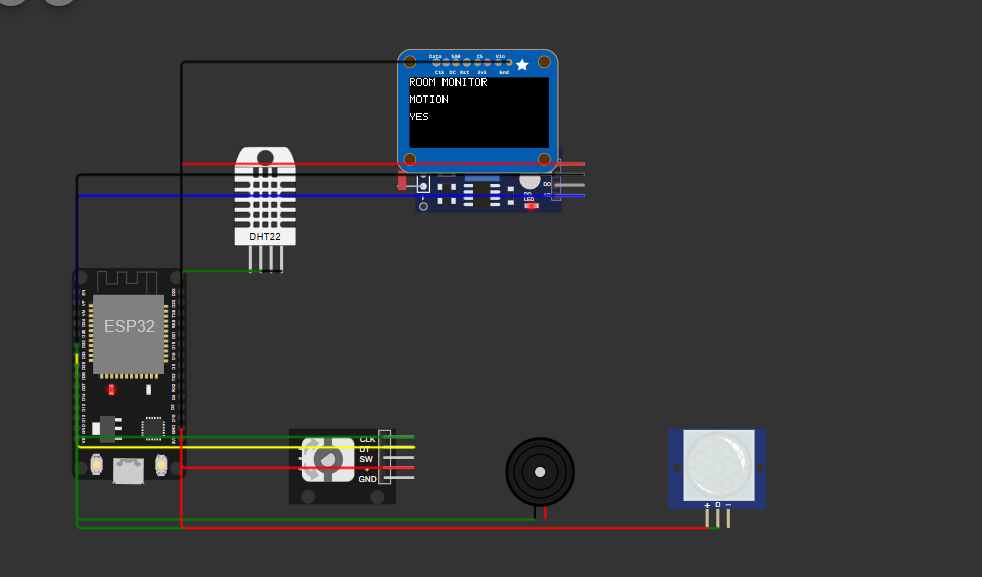
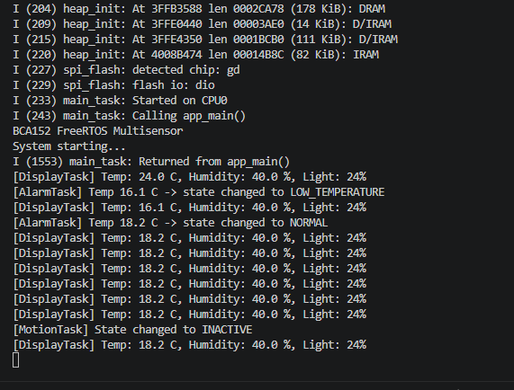
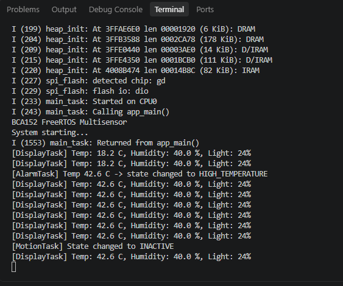

# BCA152 FreeRTOS Multisensor

## Project Overview

An ESP32 room monitoring system built on FreeRTOS. It reads temperature, humidity, and light level, shows the readings on a small OLED screen that the user can flip through with a rotary encoder, sounds a buzzer when the temperature leaves a safe range, and turns the display off automatically when the room has been empty for a while.

The point of this project wasn't just to make a working sensor box. It was to actually use FreeRTOS the way it's meant to be used — separate tasks doing separate jobs, queues carrying data between them, an event group for signaling state changes, and a mutex protecting the one shared resource that more than one task touches.

## Features

- Reads temperature and humidity from a DHT22 and light level from an LDR, both on a 2-second cycle.
- Shows the readings on a 128x64 OLED, one value at a time, and lets you cycle between Temperature, Humidity, Light, and Motion with a rotary encoder.
- Sounds a buzzer and marks the display with a `*` if the temperature goes above 30°C or below 18°C.
- Uses a PIR motion sensor to detect whether the room is occupied. If nothing moves for 15 seconds, the OLED turns off. Sensing keeps running quietly in the background, and the display comes back the moment motion is detected again.

## Learning Objectives

This project was built to demonstrate and practice the following embedded systems concepts:

1. Creating an ESP32 project using PlatformIO with the ESP-IDF framework.
2. Constructing and simulating a microcontroller circuit in Wokwi.
3. Interfacing sensors and actuators with an ESP32.
4. Organizing firmware into multiple source modules.
5. Creating and managing FreeRTOS tasks.
6. Assigning and justifying task priorities.
7. Distinguishing Running, Ready, Blocked, Suspended, and Deleted task states.
8. Using queues for inter-task communication.
9. Using a mutex to protect a shared resource.
10. Using an event group for event signaling.
11. Implementing periodic execution using `vTaskDelayUntil()`.
12. Implementing a simple embedded-system state machine.
13. Separating hardware-independent decision logic from hardware drivers.
14. Writing and executing automated unit tests using PlatformIO.
15. Performing static code analysis using PlatformIO.
16. Using Git incrementally and maintaining a professional GitHub repository.
17. Documenting a project for both academic assessment and public portfolio use.

## System Architecture

The system is built around five FreeRTOS tasks that never talk to each other directly. Everything passes through a queue or an event group instead.



The hardware layer consists of an ESP32 Dev Module, a DHT22 temperature/humidity sensor, an LDR for light level, an SSD1306 128x64 OLED over I2C, a KY-040 rotary encoder, a passive buzzer driven by LEDC PWM, and a PIR motion sensor. All of these are simulated in Wokwi — no physical hardware was used.

## Circuit



The DHT22 uses a single data pin on GPIO4. The LDR sits on GPIO36, one of the ESP32's ADC1 input-only pins — the correct choice for reading an analog sensor. The OLED talks over I2C on GPIO18 (SDA) and GPIO19 (SCL). The rotary encoder uses GPIO32 and GPIO33 for CLK and DT, kept separate from the I2C pins on purpose after running into a pin conflict earlier in development. The buzzer is driven with LEDC PWM on GPIO25 instead of a plain digital pin, since a passive buzzer needs an oscillating signal to make sound. The PIR sensor sits on GPIO26.

## FreeRTOS Architecture

The five tasks and their priorities:

- **AlarmTask** — priority 3 (highest) — event-driven from `alarmQueue` — evaluates temperature and drives the buzzer.
- **SensorTask** — priority 2 — 2-second cycle via `vTaskDelayUntil` — reads DHT22 and LDR, pushes to `sensorQueue` and `alarmQueue`.
- **InputTask** — priority 2 — ISR-driven from the encoder — updates `modeQueue` via `xQueueOverwrite`.
- **MotionTask** — priority 2 — 500 ms poll — reads PIR, updates the event group, manages ACTIVE/INACTIVE.
- **DisplayTask** — priority 1 (lowest) — 200 ms poll — owns the OLED, renders the current mode, blanks on INACTIVE.

Inter-task communication:

- `sensorQueue` (length 5) — SensorTask → DisplayTask
- `alarmQueue` (length 5) — SensorTask → AlarmTask
- `modeQueue` (length 1, overwrite) — InputTask → DisplayTask
- `systemEvents` (event group) — `EVENT_ACTIVE` (bit 0), `EVENT_MOTION` (bit 1), `EVENT_ALARM` (bit 2)
- `serialMutex` — protects `printf` / stdout across DisplayTask, AlarmTask, MotionTask

## Hardware / Simulated Components

- ESP32 Dev Module
- DHT22 temperature and humidity sensor
- LDR (photoresistor) for light level
- SSD1306 128x64 OLED display (I2C)
- KY-040 rotary encoder
- Passive buzzer
- PIR motion sensor

All components are simulated in Wokwi.

## Pin Configuration

- **DHT22 data** — GPIO 4
- **LDR analog out** — GPIO 36 (VP)
- **OLED SDA** — GPIO 18
- **OLED SCL** — GPIO 19
- **Buzzer** — GPIO 25 (LEDC PWM)
- **Encoder CLK** — GPIO 32
- **Encoder DT** — GPIO 33
- **PIR OUT** — GPIO 26

The DHT22 uses a single data pin. The LDR sits on GPIO36, one of the ESP32's ADC1 input-only pins — the correct choice for reading an analog sensor. The OLED talks over I2C. The encoder pins are kept separate from the I2C pins on purpose after running into a pin conflict earlier in development. The buzzer is driven with LEDC PWM instead of a plain digital pin, since a passive buzzer needs an oscillating signal to make sound.

## Task Design

**SensorTask** (priority 2) reads the DHT22 and LDR every 2 seconds and pushes the combined reading into two separate queues — one for the display, one for the alarm logic — since a FreeRTOS queue delivers each item to a single receiver.

**DisplayTask** (priority 1) owns the OLED. No other task writes to the screen directly. It pulls from the sensor queue, checks which display mode is currently selected, and checks the event group to know whether the system should be showing anything at all.

**InputTask** (priority 2) reads the rotary encoder through an interrupt handler and pushes the current display mode into a single-item queue using `xQueueOverwrite`, since only the latest selection matters.

**AlarmTask** (priority 3, the highest in the system) watches the temperature and drives the buzzer. It's given top priority because it does very little work per wake-up, so the cost of that priority is almost nothing — but a real temperature problem gets handled immediately instead of waiting behind a display refresh.

**MotionTask** (priority 2) polls the PIR every 500 ms and decides whether the system should be considered ACTIVE or INACTIVE, setting and clearing bits in a shared event group that other tasks can read without needing direct access to MotionTask itself.

## Inter-Task Communication

All communication between tasks goes through either a FreeRTOS queue or the event group. No shared global variables are used for data passing.

- **Queue**: Sensor data flows from SensorTask to both DisplayTask and AlarmTask through two independent queues (a single FreeRTOS queue can only deliver each item to one receiver).
- **Queue with overwrite**: The selected display mode is stored in a length-1 queue that InputTask writes with `xQueueOverwrite` — only the latest mode matters, and DisplayTask reads it with `xQueuePeek` so it doesn't remove the value.
- **Event group**: `systemEvents` carries bit flags for state signaling — `EVENT_ACTIVE`, `EVENT_MOTION`, and `EVENT_ALARM` — set and cleared by producer tasks and read non-destructively by consumers.
- **Mutex**: `serialMutex` protects the shared serial output, since DisplayTask, AlarmTask, and MotionTask can all print at different times, and printing is not naturally safe to do from multiple tasks at once.

## State Machine



The system has two states, ACTIVE and INACTIVE, tracked entirely by MotionTask. PIR motion keeps the system in ACTIVE and resets the idle timer. If 15 seconds pass with no motion, the system moves to INACTIVE and the OLED goes dark. As soon as the PIR fires again, it goes straight back to ACTIVE. Only PIR motion counts toward this — turning the encoder does not reset the timer, since the spec defines activity in terms of room occupancy, not user input.

## Repository Structure

```
bca152-freertos-multisensor/
├── include/              header files
├── lib/dht22/            custom ESP-IDF DHT22 bit-bang driver
├── src/                  task and driver source files
│   ├── main.cpp
│   ├── display.cpp
│   ├── input.cpp
│   ├── alarm.cpp
│   ├── motion.cpp
│   ├── rtos_objects.cpp
│   ├── temperature_logic.cpp
│   ├── display_logic.cpp
│   └── motion_logic.cpp
├── test/                 native unit tests (Unity framework)
│   ├── test_temperature/
│   ├── test_display/
│   └── test_motion/
├── docs/
│   ├── architecture-diagram.svg
│   ├── state-machine-diagram.svg
│   ├── functional-verification.md
│   ├── fault-experiments.md
│   └── images/
├── diagram.json          Wokwi circuit
├── wokwi.toml            Wokwi configuration
├── platformio.ini        PlatformIO configuration
└── README.md
```

## Screenshots

**OLED showing a temperature reading:**



**OLED showing the Motion page with motion detected:**



**Terminal output during a normal run:**



**Terminal showing an alarm state transition:**



## Getting Started

1. Install Visual Studio Code.
2. Install the **PlatformIO IDE** extension.
3. Install the **Wokwi for VS Code** extension.
4. Clone the repository:
   ```
   git clone https://github.com/kentjesserneri-del/bca152-freertos-multisensor.git
   ```
5. Open the folder in VS Code.

## Building the Project

This project uses PlatformIO with the ESP-IDF framework.

Build for the ESP32:

```
pio run -e esp32dev
```

Expected output: `[SUCCESS]`

## Running the Wokwi Simulation

1. Open `diagram.json` in VS Code.
2. Click the green **▶ Play** button in the top-right of the Wokwi window (or press `F1` and run `Wokwi: Start Simulator`).
3. The simulated circuit renders on the Wokwi canvas.
4. Watch the terminal at the bottom for output.

Try interacting with the DHT22 sliders, the LDR slider, the encoder knob, and the PIR trigger to observe the system's behavior.

## Unit Testing

Logic that doesn't touch hardware lives in separate `*_logic.cpp` files so it can be tested on the host machine. There are 18 tests total, covering:

- `evaluateTemperature()` — 7 tests, boundary behavior at 18°C and 30°C
- `nextDisplayMode()` / `previousDisplayMode()` — 6 tests, forward/reverse wraparound
- `evaluateSystemState()` — 5 tests, idle timeout and motion override

Run them with:

```
pio test -e native
```

Expected output: `18 test cases: 18 succeeded`.

## Static Code Analysis

`pio check -e esp32dev` uses cppcheck with `check_skip_packages = yes` so it only inspects the project's own source, not the ESP-IDF toolchain headers. The final run reports no defects.

```
pio check -e esp32dev
```

Expected output: `No defects found`.

## Functional Verification

A full verification record — including observed behavior for 20 tests covering boot, sensors, display, encoder navigation, alarm behavior, motion state, and concurrency — is in [`docs/functional-verification.md`](docs/functional-verification.md).

## Fault Experiments

Three deliberate FreeRTOS faults were introduced and observed, then reverted: removing a task's blocking delay, raising a task's priority above everything else, and removing the serial mutex. Results and analysis are in [`docs/fault-experiments.md`](docs/fault-experiments.md).

## Engineering Decisions

Several design decisions were made based on what the lab required and what worked reliably in the simulator:

1. **Native ESP-IDF drivers over Arduino libraries.** Existing PlatformIO libraries for the DHT22 (`beegee-tokyo/DHT sensor library for ESPx`, `Adafruit_DHT`) and SSD1306 (`Adafruit_SSD1306`, `ThingPulse`) all depend on the Arduino framework, which the lab prohibits. Custom native drivers were written instead — a bit-bang single-wire driver for the DHT22, and a minimal I2C driver for the SSD1306 using the new ESP-IDF v6.0.1 `i2c_master` API.

2. **LEDC PWM for the buzzer.** A plain `gpio_set_level` call didn't animate the buzzer in Wokwi. Switching to LEDC PWM at 2 kHz fixed it — and it's also the correct approach on real hardware for a passive buzzer.

3. **Pure logic separated from hardware.** Decision functions like `evaluateTemperature()`, `nextDisplayMode()`, `previousDisplayMode()`, and `evaluateSystemState()` were extracted into `*_logic.cpp` files with no hardware dependencies, so they can be unit-tested on the host machine.

4. **Event group over individual notifications.** Using a single event group with three bits (`EVENT_ACTIVE`, `EVENT_MOTION`, `EVENT_ALARM`) lets any task query system state without needing direct access to the task that produced it.

5. **Polled PIR, interrupt-driven encoder.** The PIR module already outputs a debounced digital level, so polling it every 500 ms is a simpler and reliable choice. The encoder emits raw quadrature edges, so an ISR is used to catch them.

6. **Separate queues for separate consumers.** Since a FreeRTOS queue delivers each item to exactly one receiver, SensorTask pushes to both `sensorQueue` (for DisplayTask) and `alarmQueue` (for AlarmTask).

## Limitations

1. Wokwi prints a recurring `GPIO 18 is not usable, maybe conflict with others` warning from the I2C master driver. It showed up on every pin pair tested for the OLED (21/22, 15/16, 25/26, 18/19), and the OLED renders correctly in every case — so it looks like a Wokwi quirk under ESP-IDF v6.0.1, not a wiring or code issue.

2. The hand-written DHT22 bit-bang driver can occasionally produce a transient bad reading when the simulated sensor value is changed very quickly (for example, dragging a slider in Wokwi).

3. A passive buzzer needs an oscillating signal to produce sound. A plain `gpio_set_level` didn't animate in the simulator, so the buzzer is driven with LEDC PWM at 2 kHz.

4. Rotating the encoder does not reset the inactivity timeout. Only PIR motion counts as activity, which matches the spec.

5. If a DHT22 read fails, the code falls back to 0°C rather than skipping that reading, which will incorrectly trigger `LOW_TEMPERATURE`. A more careful implementation would skip the alarm check when the read is marked invalid.

6. There's up to ~700 ms of delay between a real motion event and the display reacting, since MotionTask polls the PIR every 500 ms and DisplayTask checks the event group every 200 ms. Not instant, but not noticeable in practice.

7. Wokwi reports 2 MB flash while the real ESP32 Dev Module has 4 MB. Purely a simulator default mismatch — no functional impact.

## Future Improvements

- Skip the alarm pipeline on invalid DHT reads instead of substituting 0°C.
- Add a median-of-3 filter on the DHT22 driver to smooth out transient outliers.
- Treat encoder rotation as activity, so turning the knob wakes the display.
- Add persistence (NVS) so the last-selected display mode and thresholds survive a reboot.
- Add WiFi + MQTT for remote monitoring and cloud logging.

## References and Acknowledgments

**References:**

- [ESP-IDF Programming Guide](https://docs.espressif.com/projects/esp-idf/en/latest/)
- [FreeRTOS Documentation](https://www.freertos.org/Documentation/RTOS_book.html)
- [Wokwi Simulator Docs](https://docs.wokwi.com/)
- [PlatformIO Docs](https://docs.platformio.org/)
- [SSD1306 Datasheet](https://cdn-shop.adafruit.com/datasheets/SSD1306.pdf)
- [DHT22 Datasheet](https://www.sparkfun.com/datasheets/Sensors/Temperature/DHT22.pdf)

**Acknowledgments:**

Built for BCA152 Microcontrollers at Mindanao State University – Iligan Institute of Technology, College of Computer Studies, Department of Computer Applications.